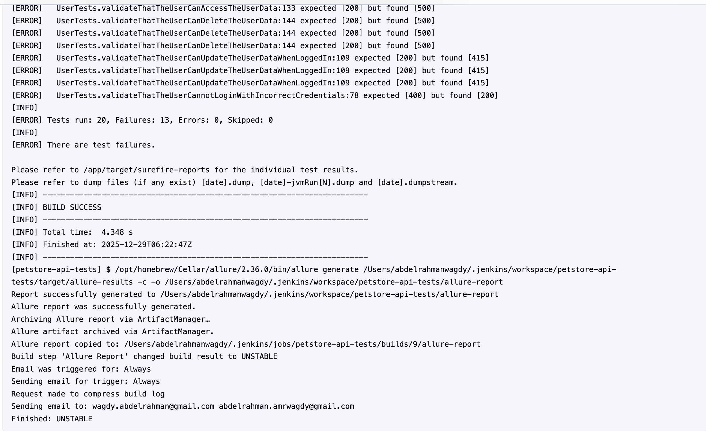
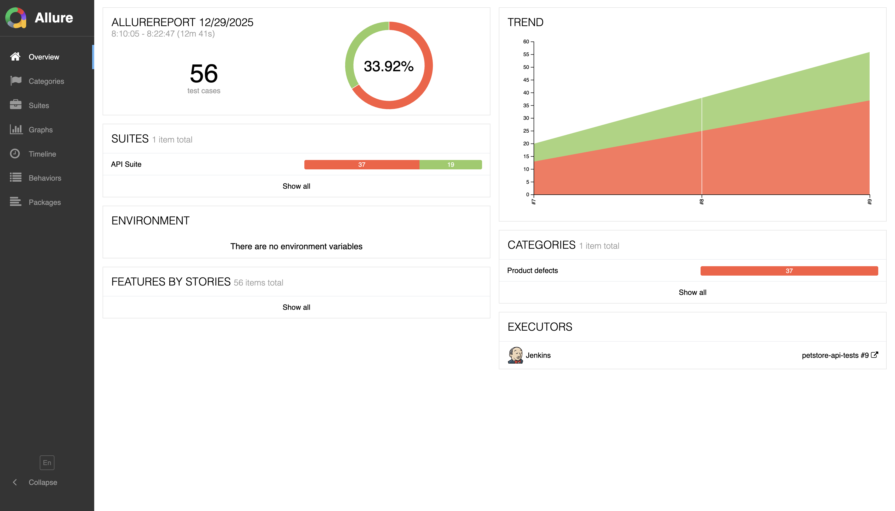
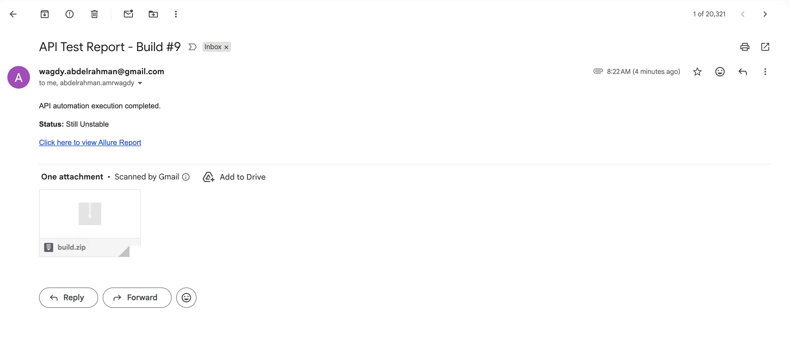

# PetStore API Testing Project

## Overview

The framework automates **CRUD operations** on the **User endpoints** of the Swagger PetStore API.

It is designed to showcase **real-world automation and CI practices**, not just local test execution.

## 🛠 Tech Stack

* Java 18 or higher
* Maven 3.6 or higher
* REST Assured
* Jenkins
* Docker (optional, for containerized execution)
* Allure report
* Gmail SMTP (Email Notifications)

## 📂 Project layout

```
PetStore/
├── src/
│   ├── main/
│   │   └── java/
│   │       ├── models/
│   │       │   └── UserModel.java
│   │       ├── services/
│   │       │   └── UserServices.java
│   │       └── utils/
│   │           └── Config.java
│   └── test/
│       ├── java/
│       │   └── usertests/
│       │       └── UserTests.java
│       └── resources/
│           ├── endpoints.properties
│           └── testng.xml
├── pom.xml
├── Dockerfile
├── Jenkinsfile
└── docs/
│   ├── screenshots/
│   │   ├── email-notification.png
│   │   ├── allure-overview.png
│   │   └── jenkins-console.png
│   └── PetStore API demo.mp4
...
```

## Dependencies

The project uses the following main dependencies:

- TestNG - Test framework
- RestAssured - API testing library
- Gson - JSON serialization/deserialization
- AssertJ - Fluent assertions
- JavaTuples - Tuple data structures
- Allure - Test reporting

## 🚀 Getting started
### Running Tests Locally

#### 1. Clone the repository

Run:
```bash
git clone https://github.com/Abdelrahman-Wagdy/PetStore.git
cd PetStore
mvn clean test 
```
### Running Tests using Docker
```bash
docker build -t petstore-api-tests .
docker run --rm petstore-api-tests
```
**OR**

#### 1. Clone the docker repo
```bash
docker pull abdelrahmanawagdy/petstoreapi:latest
```
#### 2. Run the docker image in a container
```bash
docker run -d --name myapp-container abdelrahmanawagdy/petstoreapi:latest
```
## ⚙️ CI/CD Pipeline (Jenkins)

The project includes a **Jenkins pipeline** that performs the following steps:
1. Checkout source code
2. Build Docker image
3. Execute API tests inside Docker
4. Generate Allure results
5. Publish Allure HTML report
6. Send email notification with report link

---

## 📊 CI Pipeline



---

## 📈 Allure Report



---

## 📧 Email Notification



---

## 🎥 CI Execution Demo

[▶️ Watch Jenkins + Docker + Allure demo](docs/demo.mp4)
